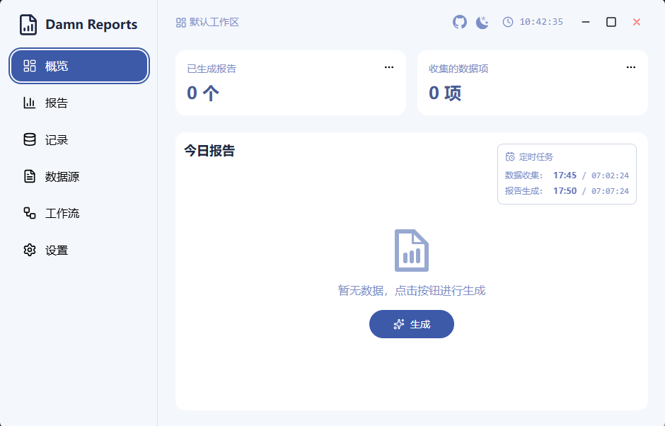
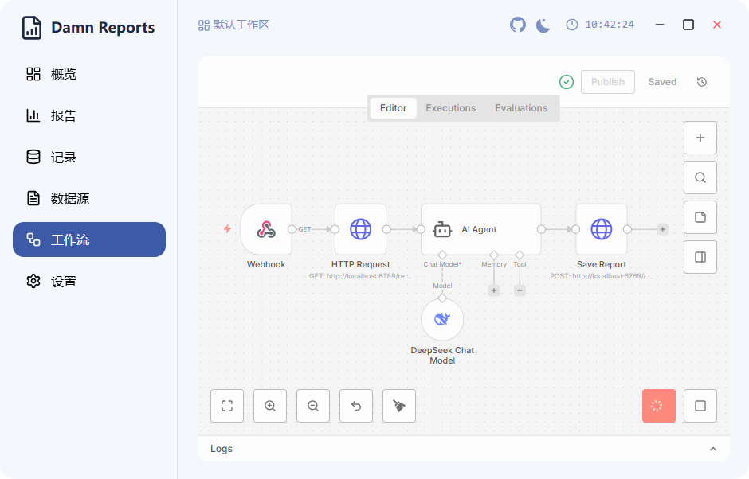

## 该死的日报 (Damn Reports)


> 很难想象在 2026 年，竟然还有公司执着于让员工每天花半小时去回应当天的“灵魂拷问”——What did you do? 与其把生命浪费在措辞委婉、注水严重的报告上，不如把这种“体力活”交给 AI。这个项目的初衷就是为了帮那些深陷日报泥潭的打工人一键脱身：毕竟，有写报告的功夫，代码都写完好几行了。

<h3>
一款基于 <a href="https://github.com/tauri-apps/tauri">Tauri</a> 开发的 AI 驱动日报生成器。
</h3>

## 功能特性

- **AI 驱动生成**：通过工作流调用 AI 生成报告（支持 [DeepSeek](https://deepseek.com/)、OpenAI 及其他主流模型）。
- **多数据源支持**：支持从 [ClickUp](https://clickup.com/)、[Git](https://git-scm.com/) 等多个平台同步工作内容。
- **定时自动生成**：不需要人工干预，系统自动生成收集数据，生成报告。
- **现代化的 UI**：基于 [HeroUI](https://hero-ui.com/) v2、[Tailwind CSS](https://tailwindcss.com/) 和 [Framer Motion](https://www.framer.com/motion/) 构建。
- **灵活的工作流**：集成 [N8N Workflow](https://n8n.io/workflows)，支持自定义的报告生成逻辑。

## 预览





## 开发指南

### 环境配置

你需要先安装 Rust 和 Node.js，具体步骤请参考 [Tauri 官方文档](https://tauri.app/start/prerequisites/)。

本项目使用 pnpm 包管理器。请参考 [安装指南](https://pnpm.io/installation) 安装 pnpm，然后安装项目依赖：

```shell
pnpm install

```

### 启动开发服务器

```shell
pnpm tauri dev

```

### 构建应用程序

```shell
pnpm tauri build

```

## 贡献

欢迎提交 Issue 或 PR！

## 开源协议

MIT License © 2024
