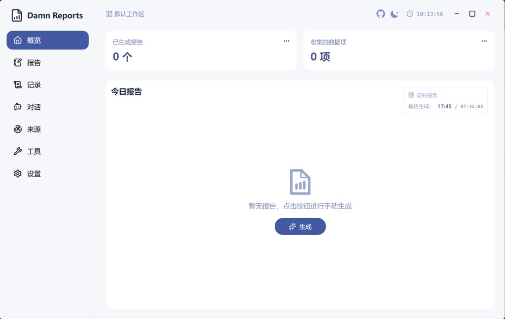
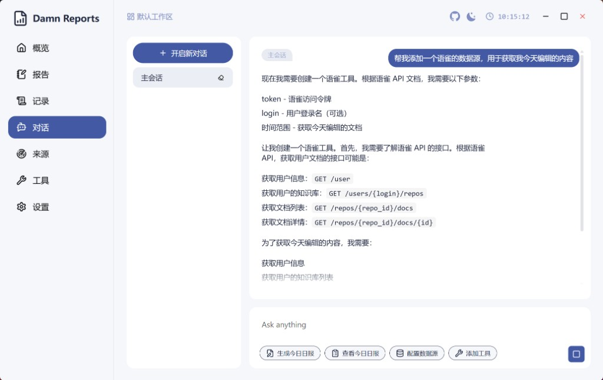

## Damn Reports


> 如果写报告的时间能换成代码，我可能已经把整个宇宙重构了。

<h3>
一款基于 <a href="https://github.com/tauri-apps/tauri">Tauri</a> 开发的 AI 驱动日报生成器。
</h3>

## 功能特性

- **AI 驱动生成**：通过调用 AI 生成报告（支持 [DeepSeek](https://deepseek.com/)、OpenAI 及其他主流模型）。
- **多数据源支持**：支持从 [ClickUp](https://clickup.com/)、[Git](https://git-scm.com/) 和任意自定义工具。
- **可扩展工具系统**：内置工具列表与搜索，支持添加/配置工具（例如 Git Directory、ClickUp Tasks）。
- **对话式工作流**：通过对话快速生成今日日报、查看今日日报、配置数据源与添加工具。
- **报告编辑与导出**：生成后可编辑内容，并支持一键复制、保存。
- **自动生成**：按计划收集数据并自动生成日报，减少人工干预。
- **现代化的 UI**：基于 [HeroUI](https://hero-ui.com/) v2、[Tailwind CSS](https://tailwindcss.com/) 和 [Framer Motion](https://www.framer.com/motion/) 构建。
- **本地数据库**：使用 SQLite 数据库，确保你的日报隐私不出本地。
- **原生 Rust 实现**：轻量级设计，移除重型依赖，性能飞升。

## 预览





## 开发指南

### 环境配置

你需要先安装 Rust 和 Node.js，具体步骤请参考 [Tauri 官方文档](https://tauri.app/start/prerequisites/)。

本项目使用 pnpm 包管理器。请参考 [安装指南](https://pnpm.io/installation) 安装 pnpm，然后安装项目依赖：

```shell
pnpm install

```

### 启动开发服务器

```shell
pnpm tauri dev

```

### 构建应用程序

```shell
pnpm tauri build

```

## 贡献

欢迎提交 Issue 或 PR！

## 开源协议

MIT License © 2024
